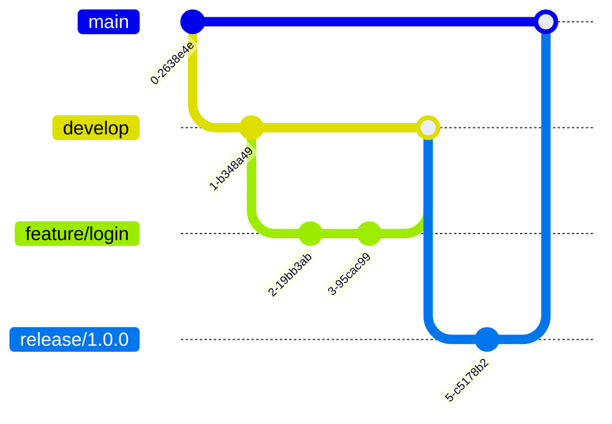
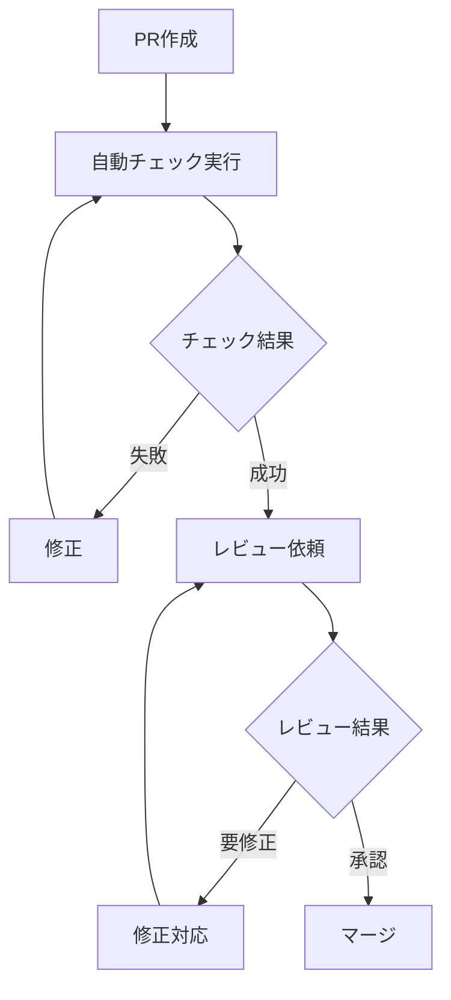

# 開発ワークフロー

## 目次

1. [ブランチ戦略](#ブランチ戦略)
2. [コミットメッセージ規約](#コミットメッセージ規約)
3. [コードレビュー基準](#コードレビュー基準)
4. [リリースフロー](#リリースフロー)
5. [CI/CD パイプライン](#cicd-パイプライン)

## ブランチ戦略

### メインブランチ



- **main**: プロダクション環境用のブランチ
- **develop**: 開発用のメインブランチ
- **feature/***: 機能開発用ブランチ
- **release/***: リリース準備用ブランチ
- **hotfix/***: 緊急バグ修正用ブランチ

### ブランチ命名規則

```
feature/[issue-id]-descriptive-name
hotfix/[issue-id]-bug-description
release/v[major].[minor].[patch]
```

### ブランチワークフロー

1. developブランチから機能ブランチを作成
2. 機能実装とテスト
3. PRを作成しレビュー
4. developブランチにマージ
5. リリース準備が整ったらreleaseブランチを作成
6. テストとバグ修正
7. mainブランチにマージ

## コミットメッセージ規約

### 基本フォーマット

```
<type>(<scope>): <subject>

<body>

<footer>
```

### コミットタイプ

| タイプ | 説明 |
|--------|------|
| feat | 新機能 |
| fix | バグ修正 |
| docs | ドキュメントのみの変更 |
| style | コードの意味に影響しない変更（空白、フォーマット等） |
| refactor | リファクタリング |
| test | テストの追加・修正 |
| chore | ビルドプロセスやツールの変更 |

### コミット例

```bash
feat(auth): add JWT authentication

- Implement JWT token generation
- Add token validation middleware
- Update user model for token storage

Closes #123
```

## コードレビュー基準

### レビューチェックリスト

1. **機能要件**
   - [ ] 仕様書の要件を満たしているか
   - [ ] エッジケースの考慮
   - [ ] エラーハンドリング

2. **コード品質**
   - [ ] コーディング規約の遵守
   - [ ] 適切な命名
   - [ ] コメントの妥当性
   - [ ] 重複コードの排除

3. **テスト**
   - [ ] ユニットテストの網羅性
   - [ ] 統合テストの実施
   - [ ] エッジケースのテスト

4. **セキュリティ**
   - [ ] 脆弱性チェック
   - [ ] 認証・認可の確認
   - [ ] データバリデーション

### レビュープロセス



## リリースフロー

### バージョニング

セマンティックバージョニングを採用：

- **MAJOR**: 後方互換性のない変更
- **MINOR**: 後方互換性のある機能追加
- **PATCH**: 後方互換性のあるバグ修正

### リリース手順

1. **リリース準備**
   ```bash
   git checkout develop
   git checkout -b release/v1.0.0
   ```

2. **バージョン更新**
   ```bash
   npm version 1.0.0
   ```

3. **テストとバグ修正**
   - 全テストの実行
   - リグレッションテスト
   - パフォーマンステスト

4. **ドキュメント更新**
   - CHANGELOGの更新
   - APIドキュメントの更新
   - デプロイ手順の確認

5. **マージとタグ付け**
   ```bash
   git checkout main
   git merge release/v1.0.0
   git tag -a v1.0.0 -m "Release v1.0.0"
   ```

## CI/CD パイプライン

### パイプライン構成


### GitHub Actions 設定例

```yaml
name: CI/CD Pipeline

on:
  push:
    branches: [ main, develop ]
  pull_request:
    branches: [ main, develop ]

jobs:
  build:
    runs-on: ubuntu-latest
    steps:
    - uses: actions/checkout@v2
    - name: Setup Node.js
      uses: actions/setup-node@v2
      with:
        node-version: '16'
    - name: Install dependencies
      run: npm ci
    - name: Build
      run: npm run build
    - name: Test
      run: npm test
    - name: Lint
      run: npm run lint

  deploy:
    needs: build
    if: github.ref == 'refs/heads/main'
    runs-on: ubuntu-latest
    steps:
    - name: Deploy to production
      run: |
        echo "Deploying to production..."
