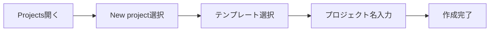

# GitHub Projects 初心者向けガイド

## はじめに

このガイドは、エンジニアでない方がGitHub Projectsを使って効率的にプロジェクト管理を行えるようになることを目的としています。

## 目次

1. [GitHub Projectsとは](#github-projectsとは)
2. [基本的な使い方](#基本的な使い方)
3. [日常的な作業の進め方](#日常的な作業の進め方)
4. [便利な使い方のコツ](#便利な使い方のコツ)
5. [よくある困ったときの対処法](#よくある困ったときの対処法)

## GitHub Projectsとは

GitHub Projectsは、タスク管理ツールの一種です。付箋を壁に貼って管理するような感覚で、デジタル上でタスクを管理できます。

主な特徴：
- タスクをカード形式で視覚的に管理
- ドラッグ&ドロップで簡単に状態を更新
- チームメンバーと進捗を簡単に共有
- 自動的にタスクの状態を更新

## 基本的な使い方

### 1. プロジェクトの作成

手順：
1. GitHubの画面上部の「Projects」をクリック
2. 「New project」ボタンをクリック
3. 「Board」を選択（付箋を貼るボード形式が最も直感的です）
4. プロジェクト名を入力して作成

### 2. 基本的なカラムの設定

最初に作るべき基本のカラム：
- 📝 Todo（これからやること）
- 🚀 In Progress（作業中）
- ✅ Done（完了したこと）

### 3. タスク（イシュー）の作成

タスクの作り方：
1. 「＋」ボタンをクリック
2. タイトルを入力
3. 説明文を書く（opcional）
4. 担当者を決める
5. 期限を設定する

## 日常的な作業の進め方

### 1. 朝の作業開始時

1. プロジェクトボードを開く
2. 「Todo」カラムから今日やることを確認
3. 着手するタスクを「In Progress」に移動

### 2. 作業中

タスクの更新方法：
1. カードをクリックして詳細を開く
2. コメントで進捗を報告
3. 必要に応じて担当者や期限を調整

### 3. 作業完了時

1. タスクを「Done」カラムに移動
2. 完了コメントを残す（任意）

## 便利な使い方のコツ

### 1. ラベルを活用する

よく使うラベル例：
- 🔴 重要
- 🟡 中程度
- 🟢 低優先度
- ⚡ 急ぎ
- 🤔 質問あり

### 2. フィルター機能の活用

よく使うフィルター：
- 自分に割り当てられたタスク
- 今週期限のタスク
- 特定のラベルがついたタスク

### 3. ビューの切り替え

1. ボード表示（カンバン方式）
   - 作業の流れを視覚的に確認
   - ドラッグ&ドロップで状態更新

2. テーブル表示
   - タスクの一覧性が高い
   - 期限や担当者で並び替え可能

## よくある困ったときの対処法

### 1. タスクが見つからない

対処法：
1. 検索バーにキーワードを入力
2. フィルターをクリアしてみる
3. 「Archive」を確認

### 2. 誤ってタスクを移動した

対処法：
1. 元のカラムに戻す
2. 履歴から状態を確認
3. アクティビティログで変更を確認

### 3. 通知が多すぎる

設定調整方法：
1. プロフィール → Settings
2. Notifications → Project preferences
3. 必要な通知のみ選択

## Tips集

### 1. ショートカットキー

よく使うショートカット：
- `Ctrl + K`：検索
- `?`：ショートカット一覧表示
- `Esc`：詳細画面を閉じる

### 2. 効率的な作業のコツ

- 朝一で優先タスクを確認する
- 終業時にタスクの状態を更新する
- 週一回はボードの整理をする

### 3. コミュニケーションのコツ

- 進捗報告は簡潔に
- ブロッカー（障害）は早めに報告
- 質問は具体的に

## まとめ

GitHub Projectsの基本的な使い方を身につけることで、以下のような効果が期待できます：

1. タスクの見える化
2. チーム内の情報共有の促進
3. 進捗管理の効率化
4. 期限管理の徹底

継続的に使用することで、プロジェクト管理のスキルが自然と身につきます。
