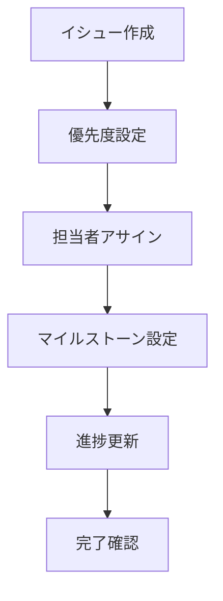

# GitHub Projects ガイド

## 目次

1. [基本設定](#基本設定)
2. [効果的な活用方法](#効果的な活用方法)
3. [自動化設定](#自動化設定)
4. [ベストプラクティス](#ベストプラクティス)
5. [トラブルシューティング](#トラブルシューティング)

## 基本設定

### プロジェクトボードの作成

1. **新規プロジェクト作成**
   - リポジトリのProjectsタブから作成
   - テーブル/ボード形式の選択
   - 基本列の設定（Todo/In Progress/Done）

2. **カスタムフィールドの追加**
   - 優先度（Priority）
   - 担当者（Assignee）
   - ラベル（Labels）
   - 期限（Due Date）

3. **ビューの設定**
   - カンバンボード
   - テーブル
   - ロードマップ
   - ガントチャート

## 効果的な活用方法

### 1. イシュー管理



### 2. スプリント管理

- スプリントの計画
- 進捗トラッキング
- ベロシティ測定
- スプリントレビュー

### 3. マイルストーン管理

- 重要な達成点の設定
- 期限管理
- 依存関係の可視化
- 進捗レポート

## 自動化設定

### 1. 基本的な自動化

```yaml
# .github/workflows/project-automation.yml
name: Project Automation
on:
  issues:
    types: [opened, closed, reopened]
  pull_request:
    types: [opened, closed, reopened]

jobs:
  project-automation:
    runs-on: ubuntu-latest
    steps:
      - uses: actions/add-to-project@v0.5.0
        with:
          project-url: ${{ secrets.PROJECT_URL }}
          github-token: ${{ secrets.GITHUB_TOKEN }}
```

### 2. カスタム自動化ルール

- イシュー作成時の自動分類
- PR作成時の自動リンク
- 完了時の自動アーカイブ
- ステータス自動更新

## ベストプラクティス

### 1. プロジェクト構造

- 明確な命名規則
- 適切な粒度のタスク
- 関連イシューのリンク
- マイルストーンの活用

### 2. ワークフロー管理


### 3. コミュニケーション

- 定期的な更新
- ブロッカーの早期発見
- チーム間の連携
- 進捗の可視化

## トラブルシューティング

### 1. 一般的な問題

| 問題 | 解決方法 |
|------|----------|
| 自動化が動作しない | トークンの確認、権限の見直し |
| ビューが更新されない | ブラウザのキャッシュクリア |
| フィールドが同期しない | プロジェクト設定の確認 |

### 2. トラブル対応フロー

1. 問題の特定
2. ログの確認
3. 設定の見直し
4. 必要に応じた再構成
5. テストと検証

### 3. 予防措置

- 定期的なバックアップ
- アクセス権限の監査
- 自動化ルールの定期確認
- ドキュメントの更新

## 付録

### テンプレート集

#### イシューテンプレート

```markdown
### 概要
[簡潔な説明を記載]

### 目的
- [ ] 達成したい目標1
- [ ] 達成したい目標2

### 受け入れ基準
- [ ] 基準1
- [ ] 基準2

### 追加情報
- 関連リンク
- スクリーンショット
```

#### プルリクエストテンプレート

```markdown
### 変更内容
[変更の概要を記載]

### 関連イシュー
- #issue番号

### チェックリスト
- [ ] テストの追加/更新
- [ ] ドキュメントの更新
- [ ] レビュー依頼
```

### ショートカットキー

| 操作 | キー |
|------|------|
| 新規イシュー | Ctrl + Alt + I |
| プロジェクト検索 | Ctrl + K |
| ビュー切替 | Ctrl + Alt + V |
| フィルター | Ctrl + Shift + F |

### 参考リンク

- [GitHub Docs - Projects](https://docs.github.com/en/issues/planning-and-tracking-with-projects)
- [GitHub Actions - Project Automation](https://github.com/marketplace/actions/add-to-github-projects)
- [Project Planning Best Practices](https://github.com/features/project-management/)
