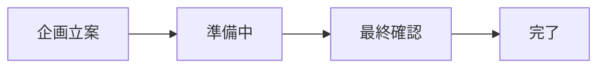

# GitHub Projects 実践活用ガイド

## プロジェクト管理の実践的なシナリオ

### 1. イベント企画での活用例

#### プロジェクトボードの構成例



具体的なタスク例：
- イベント会場の選定
- 参加者の募集
- 資料の作成
- 当日の運営マニュアル作成

### 2. 商品開発での活用例

#### マイルストーン設定

1. 企画フェーズ（2週間）
2. デザインフェーズ（3週間）
3. レビューフェーズ（1週間）
4. ローンチ準備（1週間）

### 3. 問い合わせ管理での活用例

カラム構成：
- 新規問い合わせ
- 対応中
- 確認待ち
- 解決済み
- フォローアップ要

## プロジェクト管理のベストプラクティス

### 1. 効果的なタスク分割

良い例：
```
タイトル：商品ページのヘッダー画像を更新する
詳細：
- サイズ：1200x600px
- 形式：JPG
- 納期：7/1まで
- 確認者：山田さん
```

悪い例：
```
タイトル：画像更新
詳細：なし
```

### 2. 進捗報告のテンプレート

```markdown
### 進捗状況
- 完了した作業：
- 現在の状態：
- 次のステップ：

### 課題・懸念事項
- 

### 必要なサポート
- 
```

## 効率的な運用のためのTips

### 1. プロジェクトテンプレートの活用

#### イベント企画用テンプレート
```markdown
### 基本情報
- イベント名：
- 開催日時：
- 会場：
- 参加予定人数：

### チェックリスト
- [ ] 会場予約
- [ ] 講師手配
- [ ] 告知資料作成
- [ ] 参加者募集開始
- [ ] 資料準備
- [ ] 当日マニュアル作成
```

### 2. 定期的なレビュー会議の実施

週次レビューの進め方：
1. 完了タスクの確認（10分）
2. 進行中タスクの状況確認（15分）
3. ブロッカーの特定と解決策検討（15分）
4. 次週の優先タスク決定（10分）

### 3. 効果的なラベル管理

優先度ラベル：
- 🔥 今すぐ対応
- ⚡ 今週中に対応
- 📅 来週までに対応
- 🌟 時間に余裕あり

状態ラベル：
- 🚫 ブロック中
- ❓ 要確認
- 👀 レビュー待ち
- 🔄 作業中

## 具体的な活用シナリオ

### 1. 社内イベントの企画・運営

#### フェーズ1：企画立案（2週間）
- [ ] イベントのコンセプト決定
- [ ] 予算案作成
- [ ] 会場候補リストアップ
- [ ] 講師候補リストアップ

#### フェーズ2：準備期間（1ヶ月）
- [ ] 会場予約確定
- [ ] 講師依頼・確定
- [ ] 告知資料作成
- [ ] 参加者募集開始

#### フェーズ3：直前準備（1週間）
- [ ] 参加者リスト確定
- [ ] 配布資料印刷
- [ ] 備品チェック
- [ ] 当日スケジュール確定

### 2. 新商品開発プロジェクト

#### リサーチフェーズ
- [ ] 市場調査
- [ ] 競合分析
- [ ] ターゲットユーザー定義
- [ ] 要件定義

#### 開発フェーズ
- [ ] プロトタイプ作成
- [ ] ユーザーテスト
- [ ] フィードバック収集
- [ ] 改善点の整理

#### ローンチフェーズ
- [ ] 販売戦略策定
- [ ] マーケティング資料作成
- [ ] プレスリリース準備
- [ ] 社内教育資料作成

## まとめ：成功のためのポイント

1. **明確な目標設定**
   - プロジェクトの目的を明確に
   - 達成基準を具体的に
   - タイムラインを現実的に

2. **効果的なコミュニケーション**
   - 定期的な進捗報告
   - 早めの課題共有
   - チーム内での情報共有

3. **継続的な改善**
   - 振り返りの実施
   - プロセスの改善
   - チームフィードバックの収集

4. **適切なツール活用**
   - テンプレートの活用
   - 自動化機能の利用
   - レポート機能の活用

この実践ガイドを活用することで、より効率的なプロジェクト管理が可能になります。
状況に応じて適切にカスタマイズしながら、チームに最適な運用方法を見つけていくことが重要です。
