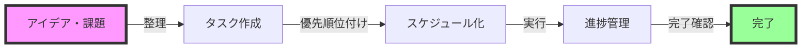
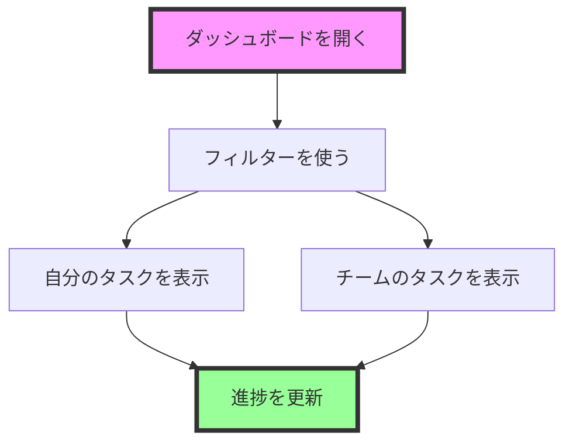

# タスク管理ガイド（はじめての方向け）

## 目次

1. [タスク管理の基本](#タスク管理の基本)
2. [GitHub Projectsでタスクを管理する](#github-projectsでタスクを管理する)
3. [コマンドでタスクを追加する方法](#コマンドでタスクを追加する方法)
4. [便利な使い方のヒント](#便利な使い方のヒント)

## タスク管理の基本

### 🎯 タスク管理とは？

タスク管理は、やるべきことを整理して、効率的に進めるための方法です。



### 📝 基本的な流れ

1. **やることを書き出す**
   - 会議でのメモ
   - 気づいたこと
   - 依頼されたこと

2. **整理する**
   - 重要度で分類
   - 期限を設定
   - 担当者を決める

3. **進める**
   - 着手
   - 進捗を更新
   - 完了を報告

## GitHub Projectsでタスクを管理する

### 🎨 タスクボードの見方

| 列の名前 | 意味 | 使うタイミング |
|---------|------|--------------|
| ToDo | これからやること | タスクを追加したとき |
| In Progress | 作業中 | タスクに取り掛かったとき |
| Done | 完了したこと | タスクが終わったとき |

### ✨ タスクの追加方法（画面から）

1. **【+】ボタンをクリック**
   
   

2. **タイトルを入力**
   - 例：「営業資料の作成」
   - 例：「週報の提出」

3. **詳細情報を設定**
   - 📅 期限
   - 👤 担当者
   - 🏷️ ラベル（種類）

## コマンドでタスクを追加する方法

### 🖥️ コマンドの使い方

1. **VSCodeを開く**
2. **ターミナルを表示**（`Ctrl + @`）
3. **以下のコマンドを入力**：

```bash
# 基本的なタスク追加
cline task "タスクのタイトル"

# 詳細情報付きのタスク追加
cline task "タスクのタイトル" --assignee "担当者名" --due "2024-03-01"
```

### 📝 コマンドの例

```bash
# 会議のタスクを追加
cline task "週次MTGの資料作成" --due "2024-02-28" --label "会議"

# プロジェクトのタスクを追加
cline task "プレゼン資料の作成" --assignee "山田太郎" --label "重要"
```

## 便利な使い方のヒント

### 🎯 効果的なタスクの書き方

良い例：
- ✅ 「2月分の経費精算書を作成する」
- ✅ 「客先プレゼン資料のレビューを依頼する」

避けたい例：
- ❌ 「資料作成」（具体的でない）
- ❌ 「至急」（何が急ぎなのか不明）

### 📊 進捗の確認方法



### 🎨 タスクの整理術

1. **色分けを活用**
   - 🔴 重要：赤ラベル
   - 🟡 中程度：黄ラベル
   - 🟢 通常：緑ラベル

2. **期限管理**
   - 📅 今日までのタスク
   - 📅 今週中のタスク
   - 📅 今月中のタスク

### 💡 便利な機能

- **フィルター機能**：自分のタスクだけを表示
- **ソート機能**：期限順に並び替え
- **ラベル**：タスクの種類で分類
- **マイルストーン**：大きな目標との紐付け

### 🔍 タスクの探し方

1. **検索バーを使う**
   - キーワードで検索
   - 担当者名で検索
   - ラベルで検索

2. **フィルターを使う**
   - 自分のタスク
   - 今週の期限
   - 未着手のタスク

## 📱 モバイルでの確認方法

1. GitHub公式アプリをインストール
2. ログインして「Projects」を選択
3. タスクボードを表示

---

## 🆘 困ったときは

- チームのリーダーに相談
- マニュアルを確認
- サポートチームに連絡

## 🎉 次のステップ

1. まずは簡単なタスクから始める
2. 徐々に機能を使いこなす
3. チームでの活用方法を相談

このガイドを参考に、効率的なタスク管理を始めましょう！
