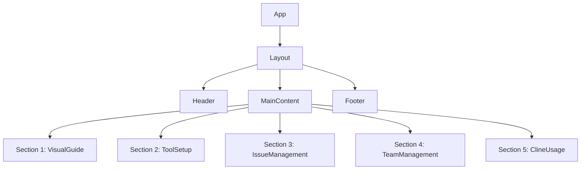
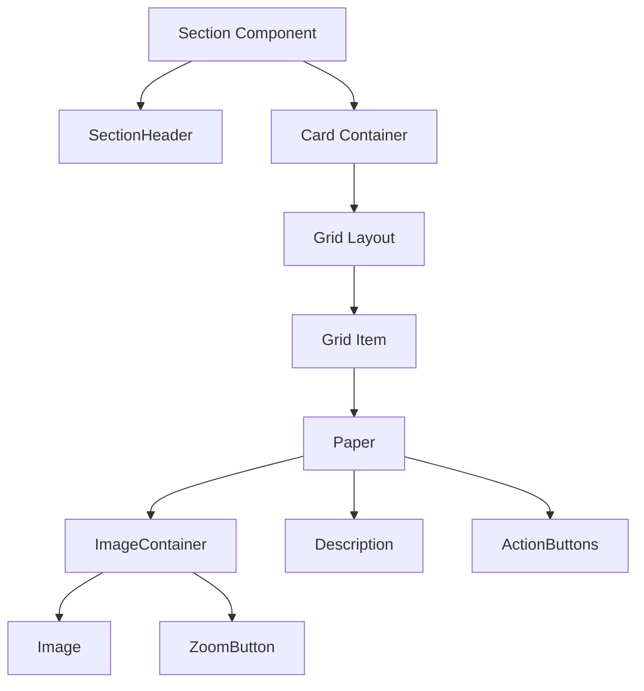
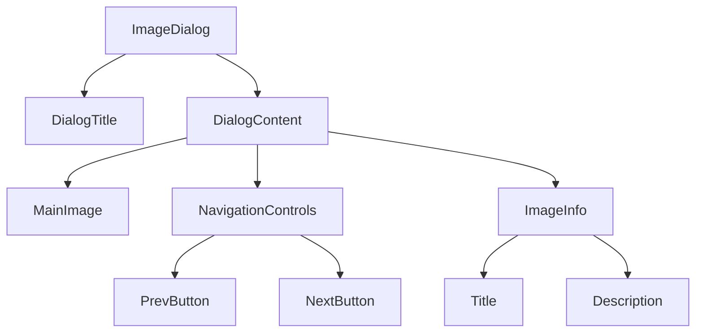
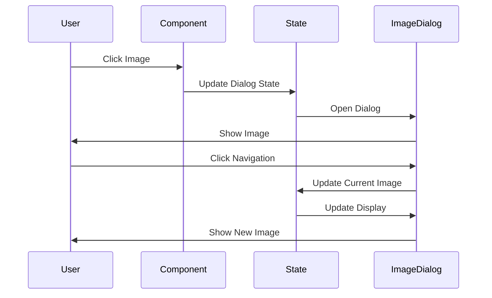
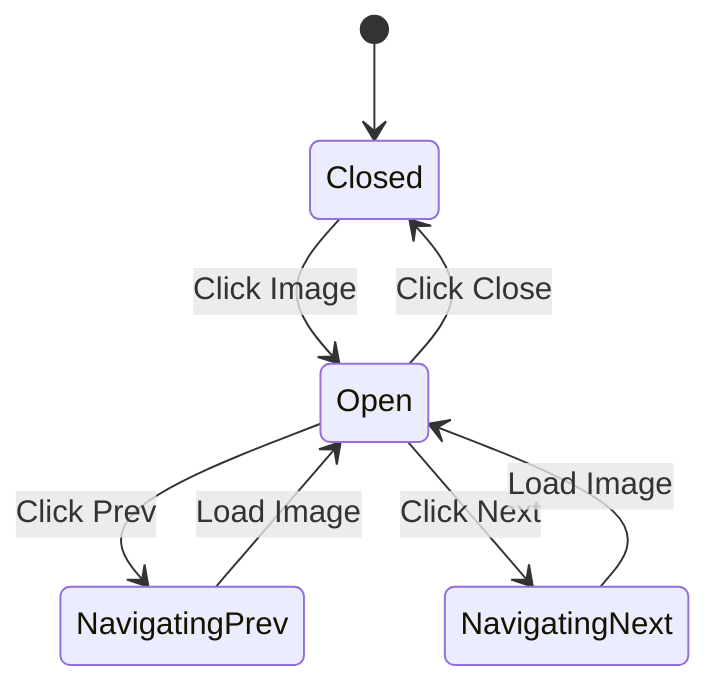
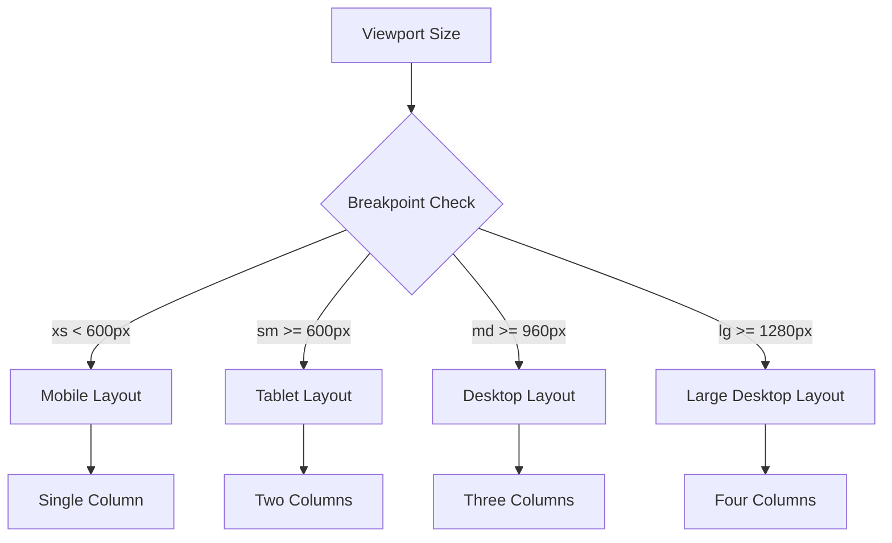
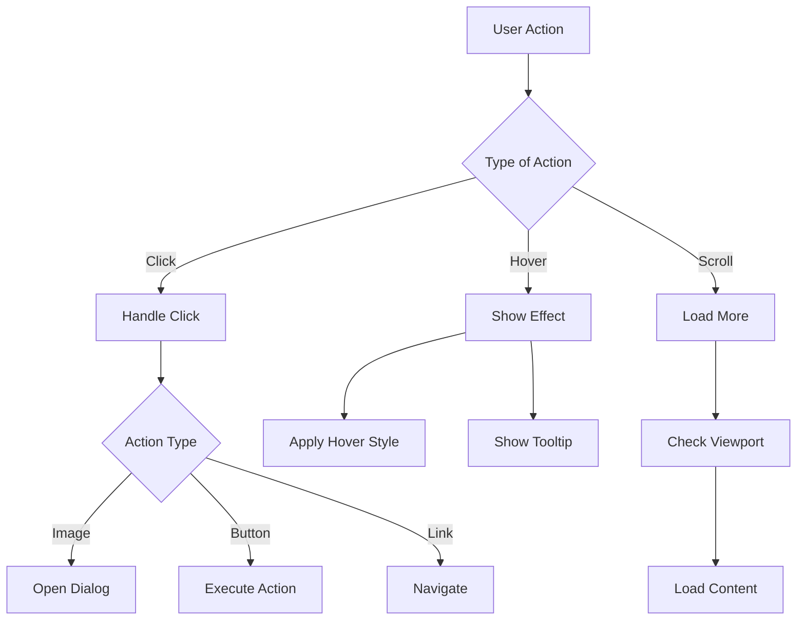

# UIコンポーネント構造図

## 1. 全体のコンポーネント階層



## 2. セクションコンポーネントの詳細構造



## 3. イメージダイアログの構造



## 4. データフロー



## 5. ステート管理



## 6. レスポンシブレイアウトフロー



## 7. インタラクションフロー



## 8. アニメーションタイムライン

```mermaid
gantt
    title コンポーネントアニメーションタイムライン
    dateFormat X
    axisFormat %L
    
    section ページロード
    Initial Fade    :0, 100
    Content Slide   :50, 150
    
    section イメージダイアログ
    Scale Up       :200, 300
    Fade In       :250, 350
    
    section インタラクション
    Hover Effect   :400, 500
    Click Effect   :450, 500
```

# コンポーネント設計の特徴

1. **モジュール性**
   - 各コンポーネントは独立して機能
   - プロパティによる柔軟なカスタマイズ
   - 再利用可能な設計

2. **パフォーマンス**
   - 遅延読み込みの実装
   - メモ化によるレンダリング最適化
   - 効率的なステート管理

3. **メンテナンス性**
   - 明確な責任分担
   - テスト可能な構造
   - ドキュメント化された API

4. **拡張性**
   - 新機能の追加が容易
   - プラグイン形式のカスタマイズ
   - テーマによるスタイル変更
